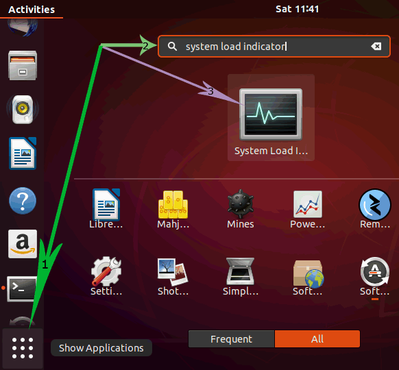
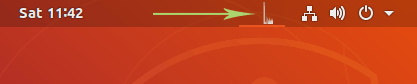
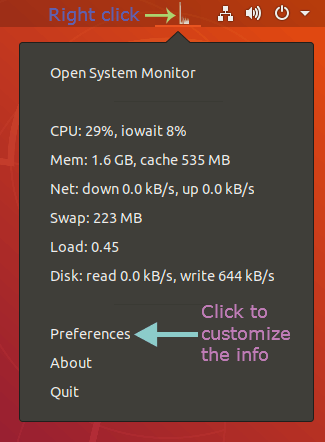
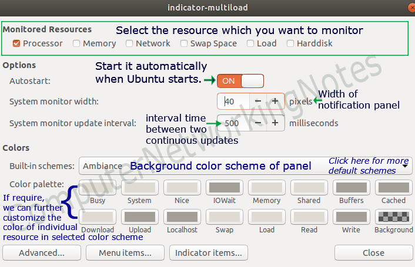
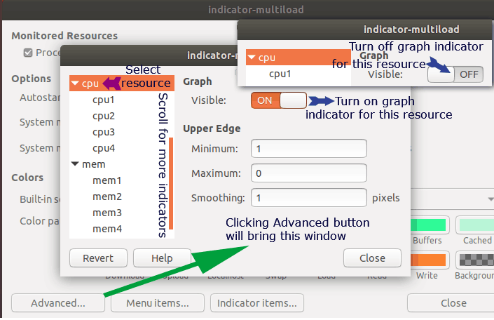

# Dashboard

I like to see my memory and CPU loads throughout my work day just to see the cause of some hangups I exprience. Because of this, I like to have this information displayed in the top bar of my desktop.

Basically all of this information was taken from [this link](https://www.computernetworkingnotes.com/linux-tutorials/ubuntu-show-cpu-and-memory-usages-in-top-bar.html) but I'm paraphrasing here for simplicity and in case the link is taken down.

The package that I use is called `indicator-multiload`.

## Installation

```
$ sudo apt-get install indicator-multiload
```

## Starting the Application

Start the application by typing "System Load Indicator" in the dash search box.



The application shows info in the graph format by default (which I do not like).



## My Customization Options

To customize the application, right click the graphical representation of the load in the top bar and click the `Preferences` menu.



1. Turn on autostart.
    
2. Go to the advanced customization screen.
    1. Turn off the graphical representation for each resource.
        
3. From the main screen, go to the `Idicator items...` screen. There will be a blank line at the top. Move one of the lines to the top and type in the following:
    ```
    CPU: $(percent(cpu.inuse)) Mem: $(size(mem.user))
    ```


