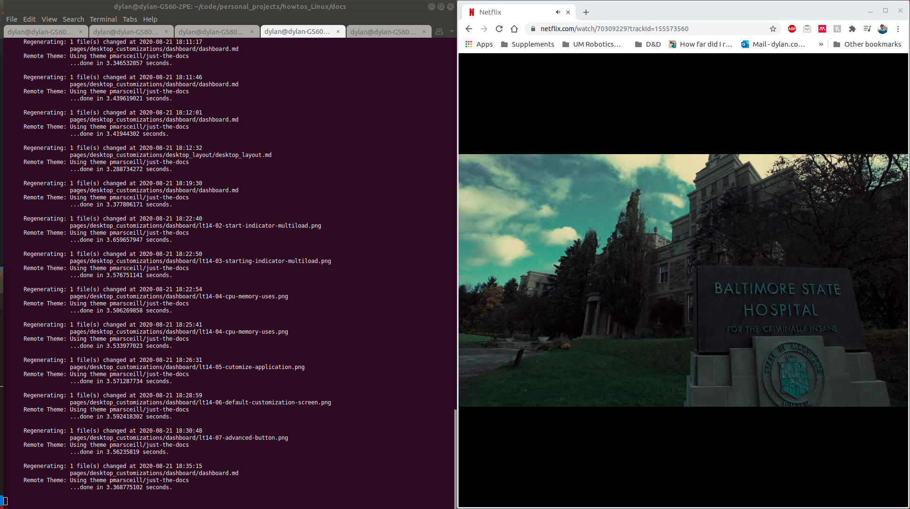
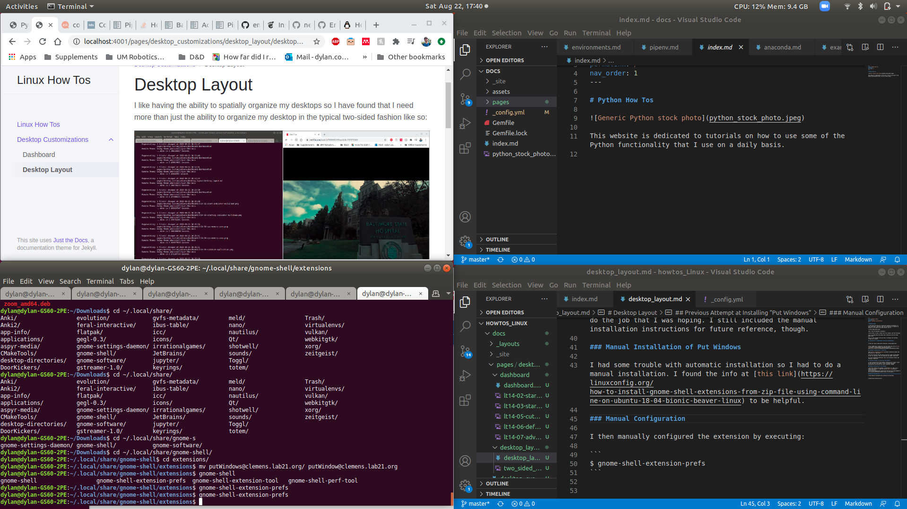

# Shell Tiling

I like having the ability to spatially organize my desktops so I have found that I need more than just the ability to organize my desktop in the typical two-sided fashion like so:



(Don't mind the Hannibal screenshot.)

I much prefer to have a layout with four windows like the following:



This is accomplished with gnome shell extensions and the chrome gnome shell.

## Automatic Installation of ShellTile

Visit [https://extensions.gnome.org](https://extensions.gnome.org) and search for "ShellTile".

Click the link and flip the switch to the far right of the window to the "on" position. This will download and enable "ShellTile".

Go to the "Installed extensions" tab in the extension browser and configure "ShellTile"

## Previous Unsatisfactory Installations

### "Put Windows"

I tried installing the "Put Windows" extension but it didn't quite do the job that I was hoping. I still included the manual installation instructions for future reference, though.

#### Manual Installation of Put Windows

I had some trouble with automatic installation so I had to do a manual installation. I found the info at [this link](https://linuxconfig.org/how-to-install-gnome-shell-extensions-from-zip-file-using-command-line-on-ubuntu-18-04-bionic-beaver-linux) to be helpful.

#### Manual Configuration

I then manually configured the extension by executing:

```
$ gnome-shell-extension-prefs
```

